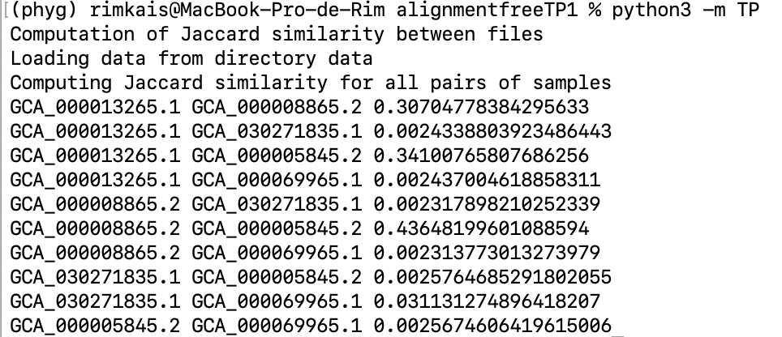

Etudiant 1 : Rim Kais
Etudiant 2 : Nadira Houch

Le but du TP est de comparer un ensemble d'echantillons de séquence d'ADN entre eux deux à deux en utilisant l'indice Jaccard

### Resultats obtenus
Le fichier kmers.py 

Ces valeurs nous donne une idée sur la similitude entre les différente séquences étudiée par exemple ici GCA_000008865.2 et GCA_000005845.2 sont les deux sequences avec le meilleur score de 0.436 c'est à dire les plus similaire 

## Scripts

### kmer
 
Le fichier kmers.py contient les fonction necessaire pour calculer lire les sequences et les diviser en kmer

kmer2str : transforme les kmer de entiers en chaine de caratére 

encode_nuc : retrourne la valeur en chiffre d'acide nucléique

encode_nuc_r : retourne le complémentaire de l'acide nucléique en chiffre

encode_kmer : calcule la valeur en entier d'un kmer et retourne la plus petite valeur entre le kmer et son complémentaire

reverse kmer : retourne le complémentaire d'un kmer

strem_kmer : calcul tout les kmer d'une seqence d'ADN 

### main

Dans le main la fonction Jaccard compare les deux sequence en calculant l'intersection et l'union de l'ensemble des kmers qui se trouve dans les deux sequences 
